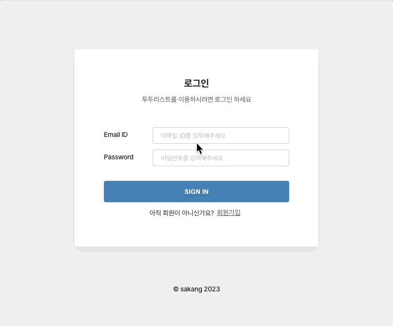

# To Do List


간단한 Todo List 웹앱입니다.

## 주소
[https://wanted-pre-onboarding-frontend-sakang07.vercel.app/](https://wanted-pre-onboarding-frontend-sakang07.vercel.app/)

## 기능
- 회원가입 및 로그인
- 투두리스트 항목의 불러오기, 저장, 수정, 삭제

## 설치

```bash
# 레파지토리 클론
$ git clone https://github.com/sakang07/wanted-pre-onboarding-frontend.git

# 디렉토리 내로 이동
$ cd wanted-pre-onboarding-frontend

# 의존성 설치
$ npm install

# 실행
$ npm start
```

## License

[MIT](https://choosealicense.com/licenses/mit/) © [강슬아 Saki](https://github.com/sakang07)
